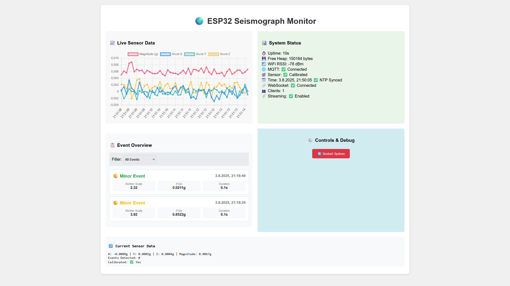

# 🌍 ESP32 Seismograph

Ein Konzept eines Seismograph basierend auf ESP32 mit MPU6050 Sensor für die Erkennung und Analyse seismischer Aktivitäten.

## 📋 Projektübersicht

Dieses Projekt implementiert einen vollwertigen digitalen Seismographen mit folgenden Hauptfunktionen:

- **Echtzeit-Seismik-Überwachung** mit MPU6050 Beschleunigungssensor
- **STA/LTA Algorithmus** für wissenschaftlich präzise Ereigniserkennung
- **Web-Interface** für Live-Monitoring und Datenvisualisierung
- **MQTT Integration** für IoT-Vernetzung und Datenübertragung
- **Dual-Core Architektur** für optimale Performance
- **Automatische Kalibrierung** und adaptive Schwellenwerte
- **OTA Updates** für Remote-Wartung

## 📷 Screenshot



## 🔧 Hardware-Anforderungen

### Hauptkomponenten
- **ESP32** (M5Stack Atom empfohlen)
- **MPU6050** Beschleunigungssensor/Gyroskop
- **RGB LED** (Pin 27) für Statusanzeige
- **Button** (Pin 39) für manuelle Steuerung

### Pin-Konfiguration
```cpp
#define RGB_LED_PIN 27
#define BUTTON_PIN 39
#define I2C_SDA_PIN 32
#define I2C_SCL_PIN 26
#define MPU6050_INT_PIN 33
```

## 📦 Software-Abhängigkeiten

### PlatformIO Libraries
```ini
lib_deps =
    knolleary/PubSubClient@^2.8          # MQTT Client
    fastled/FastLED@^3.6.0               # LED Steuerung
    electroniccats/mpu6050@^1.0.0        # MPU6050 Sensor
    bblanchon/ArduinoJson@^7.0.4         # JSON Verarbeitung
    me-no-dev/ESPAsyncWebServer@^1.2.3   # Async Web Server
    me-no-dev/AsyncTCP@^1.1.1            # TCP Library
    arduino-libraries/NTPClient@^3.2.1   # NTP Zeit-Synchronisation
    ArduinoOTA                           # Over-The-Air Updates
```

## ⚙️ Konfiguration

### WiFi-Einstellungen
```cpp
#define WIFI_SSID "IhrWiFiName"
#define WIFI_PASSWORD "IhrWiFiPasswort"
#define HOSTNAME "seismograph"
```

### MQTT-Konfiguration
```cpp
#define MQTT_SERVER "192.168.0.0" // Replace with your MQTT broker IP
#define MQTT_PORT 1884
#define MQTT_CLIENT_ID "seismograph"
#define MQTT_USER "username"
#define MQTT_PASSWORD "password"
```

### Seismograph-Parameter
```cpp
#define SAMPLING_RATE 500                // Hz - Abtastrate
#define THRESHOLD_MICRO 0.001f           // Mikrobewegungen (g)
#define THRESHOLD_LIGHT 0.005f           // Leichte Erschütterungen (g)
#define THRESHOLD_STRONG 0.02f           // Starke Erschütterungen (g)
#define STA_WINDOW 25                    // STA Fenster (0.05s)
#define LTA_WINDOW 2500                  // LTA Fenster (5s)
#define STA_LTA_RATIO 2.5f              // Trigger-Verhältnis
```

## 🚀 Installation und Setup

### 1. Hardware-Aufbau
1. ESP32 mit MPU6050 über I2C verbinden (SDA: Pin 32, SCL: Pin 26)
2. RGB LED an Pin 27 anschließen
3. Button an Pin 39 anschließen
4. Stromversorgung sicherstellen

### 2. Software-Installation
```bash
# Repository klonen
git clone <repository-url>
cd ESP32-Seismograph

# Mit PlatformIO kompilieren und hochladen
pio run -t upload

# Oder für OTA Update (nach Erstinstallation)
pio run -e ota -t upload
```

### 3. Konfiguration anpassen
1. `include/config.h` öffnen
2. WiFi-Credentials anpassen
3. MQTT-Server Einstellungen konfigurieren
4. Schwellenwerte nach Bedarf justieren

## 🌐 Web-Interface

Das System bietet ein vollständiges Web-Interface unter `http://seismograph.local` oder der IP-Adresse:

### Features
- **Live Sensor-Daten** mit Chart.js Visualisierung
- **System-Status** Überwachung
- **Event-Liste** mit Filteroptionen
- **Steuerung** für System-Restart
- **WebSocket** für Echtzeit-Updates

### Zugriff
```
http://192.168.x.x/        # Hauptseite
http://192.168.x.x/status  # System Status (JSON)
http://192.168.x.x/data    # Sensor Daten (JSON)
http://192.168.x.x/events  # Seismische Events (JSON)
```

## 📊 MQTT Topics

### Ausgehende Topics
```
tele/seismograph/data      # Sensor-Daten (alle 5 Min)
tele/seismograph/event     # Seismische Events (sofort)
tele/seismograph/status    # System-Status (alle 10 Min)
```

### Eingehende Topics
```
cmnd/seismograph/restart   # System Neustart
cmnd/seismograph/calibrate # Sensor Kalibrierung
cmnd/seismograph/debug     # Debug Modus
```

## 🔬 Wissenschaftliche Funktionen

### STA/LTA Algorithmus
- **Short Term Average (STA)**: 25 Samples (0.05s bei 500Hz)
- **Long Term Average (LTA)**: 2500 Samples (5s bei 500Hz)
- **Trigger-Verhältnis**: 2.5 für optimale Sensitivität

### Magnitude-Berechnung
```cpp
// Richter-Skala Approximation
float richter = log10(acceleration * 1000) + 3.0f;

// Lokale Magnitude
float localMag = log10(acceleration) + 1.11f * log10(distance) + 0.00189f * distance - 2.09f;
```

### Event-Klassifizierung
- **Level 1**: Mikrobewegungen (< 0.001g)
- **Level 2**: Leichte Erschütterungen (0.001-0.005g)
- **Level 3**: Starke Erschütterungen (> 0.02g)

## 🔧 Erweiterte Konfiguration

### OTA Updates
```cpp
#define OTA_HOSTNAME "seismograph"
#define OTA_PASSWORD "IhrOTAPasswort"
#define OTA_PORT 3232
```

### Task-Konfiguration
```cpp
#define SENSOR_TASK_PRIORITY 3           # Hohe Priorität für Sensor
#define BACKGROUND_TASK_PRIORITY 1       # Niedrige Priorität für Background
#define TASK_WATCHDOG_TIMEOUT_S 30       # Watchdog Timeout
```

### Speicher-Management
```cpp
#define MIN_FREE_HEAP 10000              # Minimum freier Heap (Bytes)
#define DATA_RETENTION_DAYS 90           # Daten-Aufbewahrung (Tage)
#define MAX_EVENTS_MEMORY 50             # Max Events im Speicher
```

## 📈 Monitoring und Debugging

### Status-LED Codes
- 🔵 **Blau**: System initialisiert
- 🟢 **Grün**: Alles funktional
- 🟡 **Gelb**: WiFi getrennt
- 🟣 **Lila**: MQTT getrennt
- 🔴 **Rot**: Kritischer Fehler
- 🟠 **Orange**: OTA Update

### Debug-Funktionen
```cpp
// Detailliertes Logging aktivieren
http://seismograph.local/toggle_logging

// Performance-Statistiken
Serial Monitor zeigt alle 60 Minuten Statistiken

// Heap-Überwachung
Automatische Warnung bei < 10KB freiem Speicher
```

## 🛠️ Wartung und Kalibrierung

### Automatische Kalibrierung
- Erfolgt beim Systemstart
- Erfordert 10 Sekunden Ruhe
- Kompensiert Sensor-Offset automatisch

### Manuelle Kalibrierung
```cpp
// Via Web-Interface oder MQTT
POST /calibrate
# oder
MQTT: cmnd/seismograph/calibrate
```

### Drift-Überwachung
- Automatische Überprüfung alle 5 Minuten
- Warnung bei > 20% Abweichung
- Kritisch bei > 50% Abweichung

## 📁 Projektstruktur

```
ESP32-Seismograph/
├── src/
│   ├── main.cpp                 # Hauptprogramm
│   ├── modules/                 # Kern-Module
│   │   ├── seismograph.cpp/h    # Sensor & Algorithmus
│   │   ├── data_logger.cpp/h    # Datenprotokollierung
│   │   ├── mqtt_handler.cpp/h   # MQTT Kommunikation
│   │   ├── web_server.cpp/h     # Web-Interface
│   │   ├── time_manager.cpp/h   # Zeit-Synchronisation
│   │   └── dual_core_manager.cpp/h # Multi-Core Management
│   └── utils/
│       └── led_controller.cpp/h # LED Steuerung
├── include/
│   └── config.h                 # Konfigurationsdatei
├── data/                        # Web-Interface Dateien
│   ├── index.html              # Hauptseite
│   ├── style.css               # Styling
│   └── script.js               # JavaScript
├── platformio.ini              # PlatformIO Konfiguration
└── README.md                   # Diese Datei
```

## 🔍 Troubleshooting

### Häufige Probleme

**WiFi Verbindung fehlgeschlagen**
- Credentials in `config.h` überprüfen
- Router-Kompatibilität (2.4GHz erforderlich)
- Signal-Stärke prüfen

**Sensor nicht erkannt**
- I2C Verkabelung überprüfen (SDA: 32, SCL: 26)
- MPU6050 Stromversorgung (3.3V)
- Pull-up Widerstände (meist intern)

**Falsche Ereigniserkennung**
- Kalibrierung wiederholen
- Schwellenwerte in `config.h` anpassen
- Mechanische Vibrationen eliminieren

**OTA Update fehlgeschlagen**
- Netzwerk-Konnektivität prüfen
- Passwort in `config.h` überprüfen
- Firewall-Einstellungen kontrollieren

### Debug-Kommandos
```bash
# Serial Monitor für Live-Debugging
pio device monitor

# Heap-Analyse
pio run -t monitor --monitor-filters esp32_exception_decoder

# Backtrace-Analyse (bei Crashes)
python analyze_backtrace.py
```

## 📊 Performance-Optimierung

### Empfohlene Einstellungen
- **CPU Frequenz**: 240MHz (Standard)
- **Flash Frequenz**: 80MHz
- **Partition**: Default mit LittleFS
- **Core 0**: Background-Tasks (MQTT, Web, Logging)
- **Core 1**: Sensor-Tasks (Hochfrequent)

### Speicher-Optimierung
```cpp
// Stack-Größen anpassen
#define SENSOR_TASK_STACK_SIZE 4096
#define BACKGROUND_TASK_STACK_SIZE 8192
#define WEB_SERVER_TASK_STACK_SIZE 8192
```

## 📄 Lizenz

Dieses Projekt steht unter der MIT-Lizenz. Siehe `LICENSE` Datei für Details.

## 🙏 Danksagungen

- **MPU6050 Library** von ElectronicCats
- **ESPAsyncWebServer** von me-no-dev
- **Chart.js** für Datenvisualisierung
- **PlatformIO** für die Entwicklungsumgebung

---

**Version**: 1.0.0  
**Letzte Aktualisierung**: Januar 2025  
**Kompatibilität**: ESP32, PlatformIO Core 6.0+
